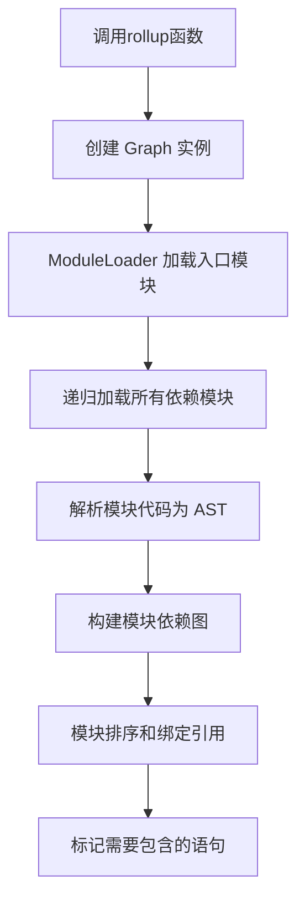
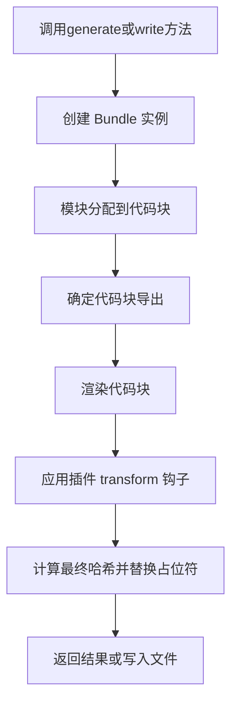

# Rollup 源码分析与上手指南

## 项目概述

Rollup 是一个现代化的 JavaScript 模块打包工具，专注于使用标准 ES 模块格式将小段代码编译为更复杂的库或应用程序。它支持"tree shaking"（摇树优化），可静态分析并排除未使用的代码，从而生成更轻量、高效的输出。

### 核心特性

1. **ES 模块优先**：基于标准 ES 模块语法进行模块化开发
2. **Tree Shaking**：静态分析导入内容，排除未使用的代码
3. **多格式输出**：支持 IIFE、CommonJS、UMD、ESM 等多种输出格式
4. **插件机制**：通过插件扩展功能
5. **高性能**：使用 Rust 编写的原生模块提升关键路径性能

## 项目架构

### 整体架构

Rollup 采用分层设计，主要包括：

- **核心引擎**：负责模块解析、依赖图构建、代码转换与优化
- **CLI 接口**：提供命令行操作入口
- **JavaScript API**：供其他工具集成调用
- **原生加速层**：通过 Rust 编写的 N-API 和 WASM 绑定提升性能

### 关键组件

1. **Graph（图）**：管理整个构建过程的状态，构建模块依赖图
2. **Module（模块）**：表示单个模块文件，处理代码解析和依赖分析
3. **Bundle（打包）**：负责代码生成阶段
4. **Chunk（代码块）**：表示输出的代码块
5. **PluginDriver（插件驱动）**：管理插件的生命周期和钩子调用

## 源码目录结构

```
src/
├── ast/                  # 抽象语法树相关处理逻辑
├── finalisers/           # 不同输出格式的代码生成器
├── rollup/               # 核心入口点
├── utils/                # 工具函数集合
├── watch/                # 监听模式相关
├── Bundle.ts             # 打包逻辑
├── Chunk.ts              # 代码块处理
├── Graph.ts              # 依赖图构建
├── Module.ts             # 模块处理
├── ModuleLoader.ts       # 模块加载器
├── browser-entry.ts      # 浏览器入口
├── node-entry.ts         # Node.js 入口

cli/
├── run/                  # CLI 运行逻辑
├── cli.ts                # CLI 入口

build-plugins/            # 构建过程使用的自定义插件

rust/                     # Rust 实现的核心模块
├── bindings_napi/        # N-API 绑定
├── bindings_wasm/        # WebAssembly 绑定
├── parse_ast/            # AST 解析加速

test/                     # 测试用例
```

## 核心工作流程

### 1. 构建阶段 (Build Phase)



关键代码位置：

- 入口：[src/rollup/rollup.ts](file:///c%3A/Users/Admin/Downloads/rollup-4.52.5/src/rollup/rollup.ts)
- 依赖图：[src/Graph.ts](file:///c%3A/Users/Admin/Downloads/rollup-4.52.5/src/Graph.ts)
- 模块加载：[src/ModuleLoader.ts](file:///c%3A/Users/Admin/Downloads/rollup-4.52.5/src/ModuleLoader.ts)
- 模块处理：[src/Module.ts](file:///c%3A/Users/Admin/Downloads/rollup-4.52.5/src/Module.ts)

### 2. 生成阶段 (Generate Phase)



关键代码位置：

- 入口：[src/Bundle.ts](file:///c%3A/Users/Admin/Downloads/rollup-4.52.5/src/Bundle.ts)
- 代码块：[src/Chunk.ts](file:///c%3A/Users/Admin/Downloads/rollup-4.52.5/src/Chunk.ts)
- 代码生成：[src/finalisers/](file:///c%3A/Users/Admin/Downloads/rollup-4.52.5/src/finalisers)

## 关键技术点

### 1. AST 解析与处理

Rollup 使用自定义的 AST（抽象语法树）结构来表示和操作代码：

- 使用 Rust 编写的高性能解析器
- AST 节点定义在 [src/ast/nodes/](file:///c%3A/Users/Admin/Downloads/rollup-4.52.5/src/ast/nodes) 目录下
- 每个节点都有 `include` 和 `hasEffects` 方法用于 Tree-shaking

### 2. Tree Shaking 实现

Tree Shaking 是 Rollup 的核心特性，通过以下方式实现：

1. 静态分析：分析 import/export 语句
2. 效果检测：通过 `hasEffects` 方法判断代码是否有副作用
3. 包含标记：通过 `include` 方法标记需要保留的代码
4. 多轮优化：多轮遍历确保所有相关代码都被正确标记

相关代码：

- [src/Module.ts](file:///c%3A/Users/Admin/Downloads/rollup-4.52.5/src/Module.ts) 中的 `includeStatements` 方法
- [src/Graph.ts](file:///c%3A/Users/Admin/Downloads/rollup-4.52.5/src/Graph.ts) 中的 Tree-shaking 逻辑

### 3. 插件系统

Rollup 的插件系统基于钩子函数，分为两类：

1. **构建钩子**：在构建阶段调用，如 `resolveId`、`load`、[transform](file:///c%3A/Users/Admin/Downloads/rollup-4.52.5/test/misc/transform.js)
2. **输出钩子**：在生成阶段调用，如 `renderChunk`、`generateBundle`

插件管理由 [PluginDriver](file:///c%3A/Users/Admin/Downloads/rollup-4.52.5/src/utils/PluginDriver.ts) 类负责。

## 开发环境搭建

### 环境要求

- Node.js >= 18.0.0
- npm >= 8.0.0
- Rust 工具链（用于构建原生模块）
- wasm-pack（用于 WASM 构建）

### 安装步骤

```
# 克隆仓库
git clone https://github.com/rollup/rollup.git
cd rollup

# 安装依赖
npm install

# 安装 Rust 工具链
# 参考 rust-toolchain.toml 中定义的版本

# 安装 wasm-pack
curl https://rustwasm.github.io/wasm-pack/installer/init.sh -sSf | sh
```

### 常用命令

```
# 完整构建
npm run build

# 快速构建（仅 JS 和 N-API）
npm run build:quick

# 构建 WASM 版本
npm run build:wasm

# 监听模式开发
npm run watch

# 运行测试
npm test

# 运行特定测试
npm run test:quick
```

## 调试与测试

### 单元测试

Rollup 使用 Mocha 作为测试框架，测试文件位于 [test/](file:///c%3A/Users/Admin/Downloads/rollup-4.52.5/test) 目录下。

运行测试：

```
# 运行所有测试
npm test

# 运行快速测试
npm run test:quick

# 运行特定测试文件
npm run test:only -- test/form/samples/basic-function-export/_config.js
```

### 调试技巧

1. 使用 `console.log` 添加调试信息
2. 利用 VS Code 的断点调试功能
3. 查看生成的 AST 结构理解代码处理过程
4. 使用 `--perf` 参数分析性能瓶颈

## 扩展开发

### 开发自定义插件

Rollup 插件是一个具有特定属性和方法的对象：

```
export default function myPlugin(options = {}) {
	return {
		name: 'my-plugin',
		// 构建钩子
		resolveId(source, importer) {
			// 处理模块解析
		},
		load(id) {
			// 加载模块内容
		},
		transform(code, id) {
			// 转换模块代码
		},
		// 输出钩子
		generateBundle(options, bundle, isWrite) {
			// 生成输出文件
		}
	};
}
```

### 贡献代码

1. Fork 仓库并创建功能分支
2. 实现功能并添加测试
3. 确保通过所有测试
4. 提交 Pull Request

遵循 [CONTRIBUTING.md](file:///c%3A/Users/Admin/Downloads/rollup-4.52.5/CONTRIBUTING.md) 中的贡献指南。

## 性能优化

Rollup 在多个方面进行了性能优化：

1. **缓存机制**：支持模块级别的缓存
2. **并发处理**：文件操作使用队列管理并发
3. **原生加速**：关键路径使用 Rust 实现
4. **AST 优化**：自定义 AST 结构减少内存占用
5. **增量构建**：监听模式下只重新构建变更部分

## 常见问题

### 1. 如何调试构建过程？

可以通过在代码中添加日志或使用 Node.js 调试器来调试构建过程。

### 2. Tree Shaking 不工作怎么办？

检查以下几点：

- 确保使用 ES 模块语法（import/export）
- 检查是否有副作用代码未正确标记
- 查看是否使用了不支持 Tree Shaking 的库

### 3. 如何处理第三方库？

使用 `@rollup/plugin-node-resolve` 和 `@rollup/plugin-commonjs` 插件来处理第三方库。

## 总结

Rollup 是一个设计精良、性能优秀的模块打包工具。通过分析其源码，我们可以学到：

1. 如何设计一个插件化的架构
2. 如何实现高效的 Tree Shaking
3. 如何处理复杂的模块依赖关系
4. 如何优化构建工具的性能

理解 Rollup 的源码不仅有助于更好地使用这个工具，也为开发类似的构建工具提供了宝贵的经验。
